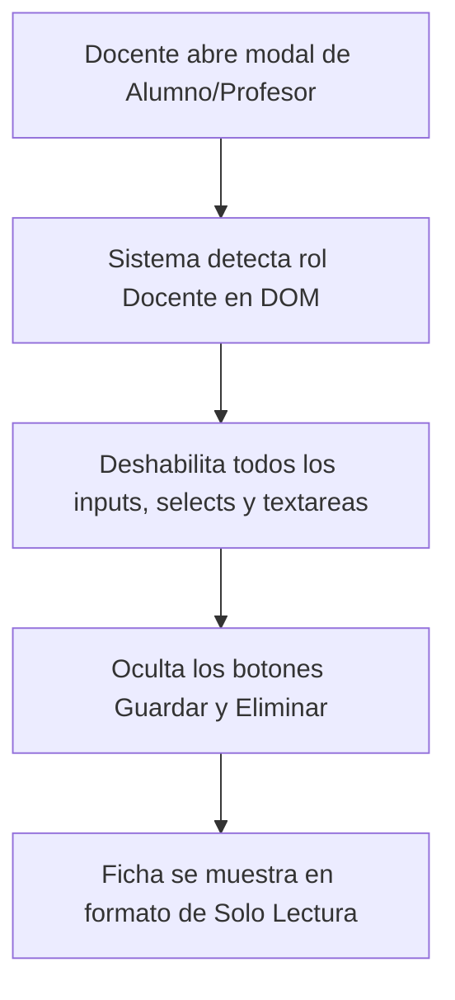
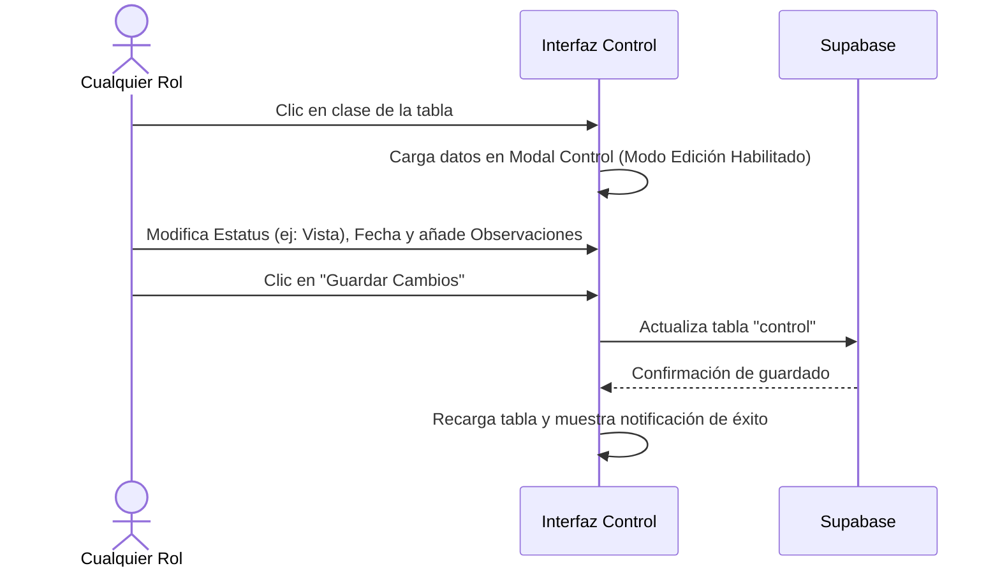

# Manual de Usuario Completo - EscuelaConSupabase

Este manual de usuario proporciona una guía exhaustiva sobre el funcionamiento y administración de la aplicación **EscuelaConSupabase**. Detalla el propósito del sistema, la configuración y el impacto de los tres roles de acceso de usuario ("Superadministrador", "Administrador" y "Docente"), así como el flujo de trabajo paso a paso para cada uno de los módulos de la aplicación.

---

## 1. Introducción y Propósito del Sistema

**EscuelaConSupabase** es una solución web diseñada para la gestión académica y operativa de instituciones educativas medianas y pequeñas. Utilizando una filosofía de desarrollo ágil y móvil-primero (*mobile-first*), la aplicación funciona sin sobrecargar el navegador con frameworks pesados, apoyándose en HTML, CSS responsivo, JavaScript puro (ES Modules) y la potencia de Supabase para la base de datos y la autenticación.

El sistema centraliza la información académica en tres grandes áreas:
1. **Configuración Estructural**: Periodos, grados, materias, programas y asignaciones.
2. **Administración de Personal y Alumnado**: Profesores y alumnos.
3. **Operación Diaria y Control**: Ejecución de clases (Control) y registro diario de asistencias.

---

## 2. Roles y Permisos en Detalle

La seguridad y accesibilidad de la aplicación están determinadas por el rol asociado al usuario que inicia sesión. Existen tres perfiles principales con comportamientos claramente delimitados a nivel de código.

### 2.1. Superadministrador (Superadmin)
Es el usuario con acceso irrestricto y de nivel de gestión global.
* **Criterio de asignación**: 
  1. Su correo electrónico es exactamente `freddybr.igle@gmail.com`.
  2. O en la tabla de **Profesores**, su campo `profe_rol` contiene el valor `Superadmin`.
* **Capacidades operativas**:
  * Acceso completo de lectura y escritura (CRUD) a los 12 módulos del sistema.
  * Habilidad exclusiva para cambiar o asignar el **Rol** de otros profesores.
  * Permiso para subir o actualizar fotografías de profesores y alumnos.
  * Capacidad de restablecer la contraseña de cualquier usuario en la base de datos (profesores y alumnos) desde el panel de Seguridad.

### 2.2. Administrador (Admin / Coordinador)
Es el usuario de gestión operativa que administra el contenido del centro escolar pero sin privilegios críticos de seguridad.
* **Criterio de asignación**: En la tabla de **Profesores**, su campo `profe_rol` contiene cualquier valor administrativo que no sea exactamente `docente` ni `superadmin` (por ejemplo: `Admin`, `Coordinador`, o `Director`).
* **Capacidades operativas**:
  * Acceso completo de lectura y escritura (CRUD) en catálogos generales, alumnos y profesores.
  * Permiso para subir o actualizar fotografías de profesores y alumnos en la pestaña de Perfil.
  * **Restricción de Roles**: No puede modificar el campo "Rol" de ningún profesor en los formularios (se muestra bloqueado).
  * **Restricción de Seguridad**: No puede cambiar la contraseña de otros usuarios (solo puede cambiar su propia contraseña).

### 2.3. Docente
Es el usuario operativo, enfocado en el aula y en el seguimiento del alumnado.
* **Criterio de asignación**: En la tabla de **Profesores**, su campo `profe_rol` contiene el valor exacto `docente` (en minúsculas o mayúsculas).
* **Capacidades operativas**:
  * **Acceso de Solo Lectura**: Materias, Grados, Programas, Periodos, Clases, Alumnos, Profesores y Asignaciones. No pueden añadir nuevos registros ni modificar los existentes.
  * **Acceso de Escritura (Completo)**: Módulo de **Control (Ejecución)** y módulo de **Asistencias**. Pueden reportar clases dadas y la asistencia de alumnos.
  * **Seguridad propia**: Puede cambiar exclusivamente su propia contraseña y configurar su tema de interfaz y tiempo de cierre de sesión por inactividad. No puede modificar fotos ni cuentas ajenas.

---

## 3. Módulos de la Aplicación y Guía de Uso

A continuación se detalla cómo interactúa cada rol con los diferentes módulos del sistema.

### 3.1. Dashboard (Panel de Control)
* **Descripción**: Muestra un resumen estadístico rápido (número total de alumnos, profesores, clases y asignaciones activas).
* **Flujo para todos los roles**: Vista informativa idéntica. Les da una bienvenida visual con su foto de perfil o iniciales.

### 3.2. Catálogos Estructurales (Materias, Grados, Programas, Periodos, Clases)
* **Descripción**: Define la currícula escolar y el horario de clases.
* **Flujo del Superadmin e Admin**:
  1. Para crear un registro, hace clic en el botón **"+"** en la cabecera, rellena el formulario del modal y presiona **Guardar**.
  2. Para editar o eliminar, hace clic en la fila de la tabla correspondiente, modifica los campos en el modal y presiona **Guardar Cambios** o **Eliminar**.
* **Flujo del Docente**:
  * Solo puede ver la tabla y sus filtros.
  * El botón **"+"** no se muestra en su interfaz.
  * Si hace clic en una fila, el modal se abre con los campos deshabilitados (color gris) y no aparecen los botones de guardar ni eliminar.

### 3.3. Registro de Alumnos y Profesores
* **Descripción**: Gestión de las personas dentro de la institución.
* **Módulo Profesores (Detalle Especial)**:
  * **Superadmin**: Puede rellenar todos los campos del profesor, incluyendo el grado que tiene asignado y su **Rol** (Superadmin, docente, coordinador, etc.).
  * **Admin estándar**: Puede rellenar los datos del profesor y su grado, pero el campo **Rol** está deshabilitado.
  * **Docente**: Ve la lista de sus colegas. Al abrir la ficha de un profesor, todos los campos (incluyendo el "Rol") están bloqueados para edición y no se muestran botones de acción.

### 3.4. Asignaciones
* **Descripción**: Vincula un Programa académico con un Grado y un Periodo lectivo específico. Es el prerrequisito para que se puedan generar clases y llevar el control académico.
* **Acciones**: El Superadmin y el Administrador pueden gestionar y dar de alta nuevas asignaciones académicas. Los Docentes solo pueden verlas en modo de lectura.

---

## 4. Operaciones Diarias (Acceso de Escritura para Todos los Roles)

Esta sección describe el núcleo del trabajo diario del Docente y del Administrador.

### 4.1. Módulo Control (Ejecución de Clases)
* **Propósito**: Llevar un registro bitácora de cada clase dictada o programada.
* **Pasos para registrar la ejecución de una clase (Todos los roles)**:
  1. Ingrese a la sección **Ejecución** en el menú.
  2. Utilice la barra de filtros o buscador si necesita localizar una asignación o clase específica.
  3. Haga clic en la fila de la clase que desea reportar.
  4. En el modal:
     * Indique la **Fecha de Clase** en el calendario.
     * Seleccione el **Profesor** asignado (la lista se filtra automáticamente mostrando los profesores válidos para el grado correspondiente).
     * Ingrese las **Observaciones** pertinentes (ej. "Se completó la unidad 2 con éxito" o "Inconvenientes con la conexión eléctrica").
     * Actualice el **Estatus** de la clase:
       * **Pendiente**: Aún no dictada.
       * **Programada**: Programada para una fecha futura.
       * **Vista**: Clase dictada y completada.
  5. Presione **Guardar Cambios**.

### 4.2. Módulo Asistencias
* **Propósito**: Controlar y grabar la asistencia diaria de los alumnos a cada clase ejecutada.
* **Pasos para registrar una asistencia (Todos los roles)**:
  1. Ingrese a la sección **Asistencias** en el menú.
  2. Haga clic en el botón **"+"** en la cabecera para abrir el modal de registro de asistencia.
  3. En el formulario:
     * **Paso 1: Asignación**: Seleccione la asignatura/grado en curso. Esto desbloquea el siguiente campo.
     * **Paso 2: Registro de Control**: Seleccione la clase correspondiente de la lista (muestra el ID de control, la fecha y el tema de clase). Esto desbloquea la lista de alumnos.
     * **Paso 3: Alumno**: Seleccione al alumno. La aplicación es inteligente y excluye automáticamente a los alumnos que ya tienen una asistencia grabada para esa clase específica.
     * **Paso 4: Estatus de Asistencia**: Elija entre *Asiste*, *Inasiste*, *Retraso*, o la nomenclatura de la escuela.
     * **Paso 5: Observaciones (Opcional)**: Agregue detalles (ej. "Justificó por cita médica").
  4. Haga clic en **Guardar**.
  5. Repita el proceso para los demás alumnos de la clase.

---

## 5. Configuración del Sistema y Seguridad

Ubicado al final del menú lateral, este módulo permite administrar los aspectos técnicos y visuales de la aplicación.

### 5.1. Pestaña Perfil (Superadmin y Administrador)
* Permite subir fotos y asociarlas a los registros existentes de profesores o alumnos.
* Seleccione el tipo de usuario (Profesor/Alumno), busque el nombre y suba el archivo de imagen. El sistema lo convertirá a un formato optimizado y lo guardará en la base de datos.
* *Nota: Esta pestaña está completamente oculta para el rol Docente.*

### 5.2. Pestaña Seguridad
* **Para el Superadmin**:
  * Puede cambiar su propia contraseña.
  * Dispone de un selector desplegable con todos los correos del sistema (alumnos y profesores) para restablecer la contraseña de cualquier usuario.
* **Para el Administrador e Docente**:
  * Solo pueden ingresar y actualizar la contraseña de su sesión activa. El selector de terceros está oculto.
* **Todos los Roles - Inactividad**:
  * Pueden definir tras cuántos minutos de inactividad del cursor/teclado la aplicación debe cerrar la sesión automáticamente por seguridad (opciones: Nunca, 1 minuto [pruebas], 15, 30 o 60 minutos).

### 5.3. Pestaña Apariencia (Temas)
Todos los roles pueden configurar la estética de su aplicación. Al seleccionar una tarjeta de tema, este se guarda en el navegador del usuario de inmediato:
* **Claro**: Colores blancos y grises de alta legibilidad.
* **Oscuro**: Diseñado para entornos oscuros o cuidado de la fatiga visual.
* **Sepia**: Fondo cálido tipo lectura de libro.
* **Océano Blue**: Tonos azulados y frescos.
* **Bosque**: Fondo blanco con realces en tonos verdes naturales.
