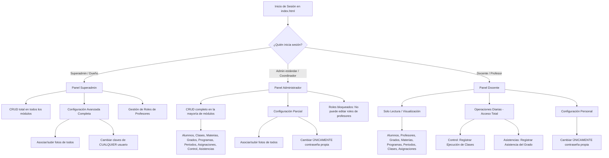

# Manual de Usuario Corto - EscuelaConSupabase

Este manual ofrece una perspectiva rápida y visual del funcionamiento de la aplicación y la división de responsabilidades según los tres roles de acceso definidos en el sistema.

---

## 1. Mapa del Flujo de Usuario y Roles

El siguiente diagrama ilustra el camino de navegación y las capacidades operativas de cada rol al ingresar al sistema.

---

## 2. Matriz de Permisos Rápida

| Módulo / Funcionalidad | Superadministrador | Administrador (Admin) | Docente |
| :--- | :---: | :---: | :---: |
| **Dashboard** | 👁️ Ver todo | 👁️ Ver todo | 👁️ Ver todo |
| **Materias, Grados, Programas** | ✍️ CRUD | ✍️ CRUD | 👁️ Solo Lectura |
| **Periodos, Clases, Asignaciones** | ✍️ CRUD | ✍️ CRUD | 👁️ Solo Lectura |
| **Alumnos** | ✍️ CRUD | ✍️ CRUD | 👁️ Solo Lectura |
| **Profesores (Datos generales)** | ✍️ CRUD | ✍️ CRUD | 👁️ Solo Lectura |
| **Profesores (Campo "Rol")** | ✍️ Modificar Rol | ❌ Bloqueado | ❌ Bloqueado |
| **Control (Ejecución de Clases)** | ✍️ CRUD | ✍️ CRUD | ✍️ CRUD |
| **Asistencias** | ✍️ CRUD | ✍️ CRUD | ✍️ CRUD |
| **Config. Perfil (Subida de fotos)** | 📷 Gestionar Fotos | 📷 Gestionar Fotos | ❌ Pestaña Oculta |
| **Config. Seguridad (Clave propia)** | 🔑 Cambiar | 🔑 Cambiar | 🔑 Cambiar |
| **Config. Seguridad (Claves ajenas)** | 🔑 Cambiar | ❌ Bloqueado | ❌ Bloqueado |

---

## 3. ¿Cómo identificar qué rol tengo?

1. **Superadministrador (Superadmin)**: Tu correo es `freddybr.igle@gmail.com` o el campo **Rol** en tu ficha de profesor dice exactamente `Superadmin`.
   * *Señal en la app*: Tienes acceso a todo, puedes cambiar contraseñas de otros en *Configuración > Seguridad* y puedes modificar el campo "Rol" de cualquier profesor.
2. **Administrador (Admin)**: El campo **Rol** en tu ficha de profesor contiene cualquier texto administrativo que no sea `docente` ni `superadmin` (ej: `Admin`, `Coordinador`, `Director`).
   * *Señal en la app*: Puedes crear y editar alumnos, materias, etc., y subir fotos. Sin embargo, no puedes editar el campo "Rol" de tus colegas y no puedes cambiar contraseñas ajenas.
3. **Docente**: El campo **Rol** en tu ficha de profesor dice exactamente `docente`.
   * *Señal en la app*: En la mayoría de módulos no verás el botón "+" y los formularios de detalle aparecerán de solo lectura (campos grises y sin botones de guardar o eliminar). Solo puedes escribir en *Control* y *Asistencias*.
